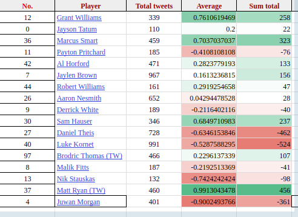

# tweets
A project that is an ettmept to measure the twitter's public opinion of NBA players.

#### Collecting tweets
Using Twitters API, searches will be made to collect tweets and replies that mention a specified NBA player. Tweets from more that 2 days ago will not be used in order to ensure the data represents the current public opinion of these said player. 

#### Measuring sentiment
Google's natural language api will be used to measure how positive or negative the sentiment of tweets about certain players are. The api can take text and assign a number between -1.0 and 1.0 to represent the sentiment of the text. 

#### Displaying the results
Tables will be used to to show the mean and total sum of sentiments along with the number total numer o ftweets in the sample. It will be displayed in a fashion simialr to below.

 
</img>  

#### Final words
Some future improvements I can see now:
1. Making a page for individual players to see some highlighted tweets.
2. Making something similar for teams and coaches.
3. Better front end.
