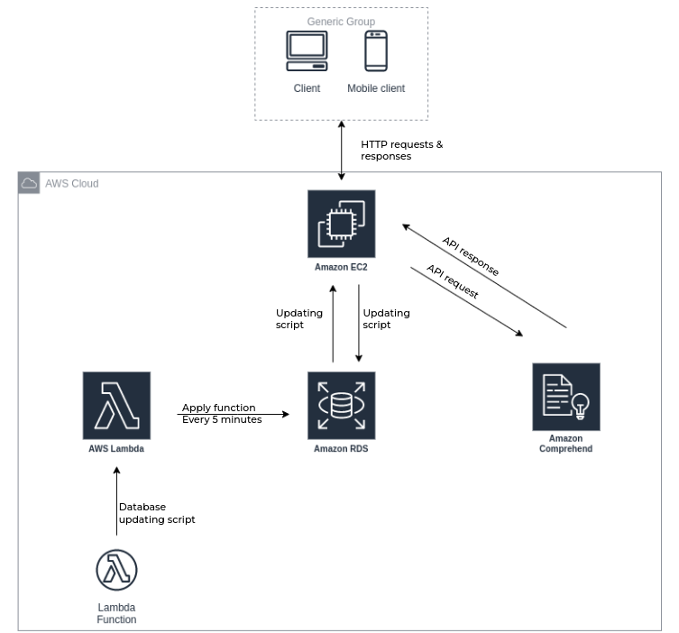

# NBA Tweets are Talking

A project that is an ettmept to measure the twitter's public opinion of NBA players for followers of NBA twitter.

Using Twitters API, searches will be made to collect tweets and replies that mention a specified NBA player. Tweets from more that 2 days ago will not be used in order to ensure the data represents the current public opinion of these said player. 


## System Design

<p align="center">
</img>
</p>

## Run Locally

Clone the project

```bash
  git clone https://github.com/coparaoji/tweets.git
```

Go to the project directory

```bash
  cd tweets
```

Install dependencies

```bash
  pip -r docs/requirements.txt
```

Start the server

```bash
  python3 app.py
```


## Presentation

[Presentation](https://docs.google.com/presentation/d/1Nb5vvN_XXGx6za1ZV8ilrjVG8_3qM_r5jGn9zps7m4o/edit?usp=sharing)


## Appendix

Project is still under construction.
